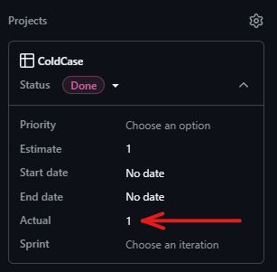
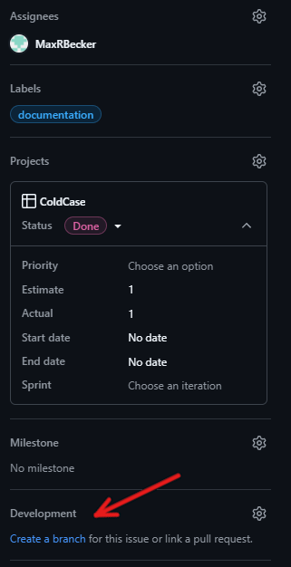

# Best Practices

## Story duration - Actual 

After compleating each issue it is mandatory to note your time spend on the issue. Use the "Actual" field of the issue itself. The time you spend working on the issue is rounded up to the next full hour -> 1h20min is going to be recorded as 2h




## Working on an issue

### New branch
If the issue requires changes to the repository you create a new branch for the issue. Such a branch is called a feature or bug branch, depending on the type of issue.

This can be done from the issue (see image below), which links the new branch to the issue automatically. Alternatively, this can be done manually by clicking on the cog icon next to the "Development" Section of the issue.

**ALWAYS LINK YOUR BRANCH TO THE CORRESPONDING ISSUE**




#### Naming convention for feature branch

Feature branch name as follows "NR-issue-name-in-kebap-case".  
Bsp.: 9-update-feature-branch-naming-convention

### Commenting your Implementation

Anotate your Classes and Methods with JavaDoc!

#### Classes

Short description of the class, what it is supposed to do and what dependencies it has.

Bsp.:
```java
/**
 * Class for generating maps from text files.
 * <p>
 * This class is a singleton, and can be accessed using the {@link #getInstance()} method.
 * It provides methods for serializing and deserializing maps to and from JSON.
 * The JSON format used is the one provided by the {@link Json} class provided by libGDX.
 */
public class MapGenerator {}
```

#### Methods

Use the `@param`, `@throws` and the `@returns` JavaDoc annotations.

Bsp.:
```java
/**
* Continuously updates the map until no further updates are possible.
*
* <p>Keeps trying to update the map with the given {@code InteractionChain} until no more changes occur.</p>
*
* @param chain the {@code InteractionChain} used to manage interactions and snapshots during updates
* @throws IllegalStateException if the maximum iteration limit is exceeded, suggesting a potential cyclic dependencyn {@code TileContent}.
* @implNote This method has a limit on the number of iterations to prevent endless loops. If one {@code TileContent}
* triggers another in a cyclic manner, the loop may otherwise never terminate.
*/
public void updateUntilStable(InteractionChain chain) throws GameStateUpdateException {...}
```


### Testing your Implementation

Befor creating your PR you should always write new or update existing tests for your code changes. Code Coverage has to be above 80% for files you changed!

To create an Overview about the the different logcal paths of your implementation you should always document the edgecases to test in the JavaDoc of the Method:
```java
/**
* @implNote case x should result in method call y
*           case z should result in method call a
*           The code has <this unique feature> you need to consider when testing
*/
```

---
### Coding best practices

- if you work with InteliJ Idea regularly press `Strg + Alt + L` to reformat your file

---
### Commit Messages

Commit message name as follows "NR short summary of your changes".  
Bsp.: "9 changed naming conventio to kabab case for issue branches"


---
### Pushing to development

After compleating the issue:

1. create and resolve a pull-request from from development branch to your feature branch (this is to prevent merge conflicts on development)
2. create a pull-request from from development branch to main branch
3. 2 or more coworkers have to approve the pull-request 
4. merge the pull-request


## Pushing to main

1. create a pull-request from from development branch to main branch
2. 2 or more coworkers have to approve the pull-request 
3. merge the pull-request

